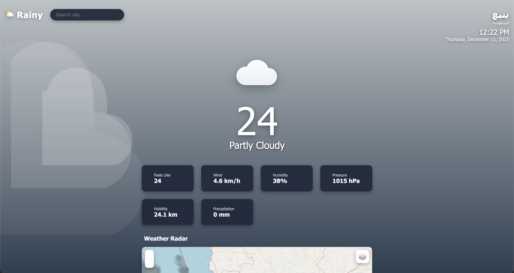

<a id="readme-top"></a>
<br />
<div align="center">
  <a href="https://github.com/syslink-sh/rainy">
    
  </a>

<h3 align="center">Rainy 🌦️</h3>

  <p align="center">
    Rainy is a modern, high-performance weather application that delivers real-time forecasts for cities worldwide. Experience accurate weather data, interactive radar, and a seamless user interface.
    <br />
    <a href="https://github.com/syslink-sh/rainy/tree/main/docs"><strong>Explore the docs »</strong></a>
    <br />
    <br />
    <a href="https://rainy.syslink.dev">View Demo</a>
    &middot;
    <a href="https://github.com/syslink-sh/rainy/issues/new?labels=bug">Report Bug</a>
    &middot;
    <a href="https://github.com/syslink-sh/rainy/issues/new?labels=enhancement">Request Feature</a>
  </p>
</div>

<div align="center">
  <a href="https://github.com/syslink-sh/rainy">
    
  </a>

  <h3 align="center">Rainy 🌦️</h3>

  <p align="center" style="font-size:1.15em;max-width:600px;">
    <strong>Rainy</strong> is a modern, high-performance weather application delivering real-time forecasts for cities worldwide.<br>
    Enjoy accurate weather data, interactive radar, and a seamless, friendly user experience.
    <br><br>
    <a href="https://rainy.syslink.dev" style="font-weight:600;background:#4facfe;color:white;padding:0.5em 1.2em;border-radius:8px;text-decoration:none;box-shadow:0 2px 8px #4facfe44;">🌐 Live Demo</a>
    &nbsp;|&nbsp;
    <a href="https://github.com/syslink-sh/rainy/tree/main/docs">📚 Docs</a>
    &nbsp;|&nbsp;
    <a href="https://github.com/syslink-sh/rainy/issues/new?labels=bug">🐞 Report Bug</a>
    &nbsp;|&nbsp;
    <a href="https://github.com/syslink-sh/rainy/issues/new?labels=enhancement">✨ Request Feature</a>
  </p>

  <!-- Badges -->
  <p align="center">
    <a href="https://github.com/syslink-sh/rainy/graphs/contributors"></a>
    <a href="https://github.com/syslink-sh/rainy/network/members"></a>
    <a href="https://github.com/syslink-sh/rainy/stargazers"></a>
    <a href="https://github.com/syslink-sh/rainy/issues"></a>
    <a href="https://github.com/syslink-sh/rainy/blob/main/LICENSE"></a>
  </p>
</div>

<details>
  <summary>Table of Contents</summary>
  <ol>
    <li>
      <a href="#about-the-project">About The Project</a>
      <ul>
        <li><a href="#built-with">Built With</a></li>
      </ul>
    </li>
    <li>
      <a href="#getting-started">Getting Started</a>
      <ul>
        <li><a href="#prerequisites">Prerequisites</a></li>
        <li><a href="#installation">Installation</a></li>
      </ul>
    </li>
    <li><a href="#usage">Usage</a></li>
    <li><a href="#pwa-installation">PWA Installation</a></li>
    <li><a href="#api-endpoints">API Endpoints</a></li>
    <li><a href="#contributing">Contributing</a></li>
    <li><a href="#license">License</a></li>
    <li><a href="#contact">Contact</a></li>
    <li><a href="#acknowledgments">Acknowledgments</a></li>
  </ol>
</details>

## About The Project

<div align="center">
  
  <br>
  
</div>

<div align="center">
  
  <br>
  
</div>

Rainy offers:

* **Real-Time Weather:** Current temperature, apparent temperature, wind speed, humidity, pressure, and visibility
* **Live Radar:** Interactive precipitation and cloud cover radar map
* **Hourly Forecast:** 24-hour breakdown for daily planning

<p align="right">(<a href="#readme-top">back to top</a>)</p>

### Built With

* [![Node.js][Node.js]][Node-url]
* [![Express][Express.js]][Express-url]
* [![JavaScript][JavaScript]][JavaScript-url]
* [![CSS3][CSS3]][CSS3-url]
* [![Leaflet][Leaflet]][Leaflet-url]

<p align="right">(<a href="#readme-top">back to top</a>)</p>

## Getting Started

To get a local copy up and running follow these simple steps.

### Prerequisites

* Node.js 18+
* npm
  ```sh
  npm install npm@latest -g
  ```

### Installation

1. Clone the repo
   ```sh
   git clone https://github.com/syslink-sh/rainy.git
   ```
2. Navigate to the project directory
   ```sh
   cd rainy
   ```
3. Install NPM packages
   ```sh
   npm install
   ```
4. Start the server
   ```sh
   npm start
   ```
5. Open your browser and visit `http://localhost:3005`

## Getting Started

To get started locally, follow these steps:

### Prerequisites

- Node.js 18+
- npm (latest recommended)
  ```sh
  npm install npm@latest -g
  ```

### Installation

1. **Clone the repository**
   ```sh
   git clone https://github.com/syslink-sh/rainy.git
   ```
2. **Navigate to the project directory**
   ```sh
   cd rainy
   ```
3. **Install dependencies**
   ```sh
   npm install
   ```
4. **Start the server**
   ```sh
   npm start
   ```
5. **Open your browser** and visit [http://localhost:3005](http://localhost:3005)

<p align="right">(<a href="#readme-top">back to top</a>)</p>

## Usage

### Development Mode

Run with auto-reload on file changes:
```sh
npm run dev
```

### Production Mode

```sh
NODE_ENV=production npm start
```

### Configuration

Configuration is handled via `server/config.js` and `public/js/config.js`:

**Server Config** (`server/config.js`):
| Setting | Description | Default |
|---------|-------------|---------|
| `server.port` | Server port | `3005` (dev) / `5150` (prod) |
| `server.env` | Environment | `development` |
| `cors.allowedOrigins` | CORS origins | localhost, rainy.syslink.dev |

**Frontend Config** (`public/js/config.js`):
| Setting | Description |
|---------|-------------|
| `apiBaseUrl` | API endpoint (auto-detected) |
| `defaultLocation` | Fallback location if geolocation fails |
| `map` | Map zoom and tile settings |

<p align="right">(<a href="#readme-top">back to top</a>)</p>

## PWA Installation

### On Mobile (iOS/Android)
1. Open [rainy.syslink.dev](https://rainy.syslink.dev) in your browser
2. **iOS**: Tap the Share button → "Add to Home Screen"
3. **Android**: Tap the menu → "Add to Home Screen" or "Install app"

### On Desktop (Chrome/Edge)
1. Open [rainy.syslink.dev](https://rainy.syslink.dev)
2. Click the install icon in the address bar, or
3. Menu → "Install Rainy..."

<p align="right">(<a href="#readme-top">back to top</a>)</p>

## API Endpoints

| Endpoint | Description |
|----------|-------------|
| `GET /api/health` | Health check with uptime and status |
| `GET /api/weather?lat=&lon=` | Get weather data for coordinates |
| `GET /api/search?q=` | Search cities by name |
| `GET /api/reverse-geocode?lat=&lon=` | Get city name from coordinates |

<p align="right">(<a href="#readme-top">back to top</a>)</p>

## Contributing

Contributions are welcome and appreciated. To propose improvements or new features, please fork the repository and submit a pull request. You may also open an issue for bug reports or feature requests.

1. Fork the repository
2. Create your feature branch (`git checkout -b feature/YourFeature`)
3. Commit your changes (`git commit -m 'Add YourFeature'`)
4. Push to your branch (`git push origin feature/YourFeature`)
5. Open a pull request

<p align="right">(<a href="#readme-top">back to top</a>)</p>

### Top contributors:

<a href="https://github.com/syslink-sh/rainy/graphs/contributors">
  
</a>

### Contributor Highlights

<a href="https://github.com/syslink-sh/rainy/graphs/contributors">
  
</a>

## License

Distributed under the ISC License. See `LICENSE` for more information.

<p align="right">(<a href="#readme-top">back to top</a>)</p>

## Contact

SySLink - [@syslink_sh](https://twitter.com/syslink_sh)

Project Link: [https://github.com/syslink-sh/rainy](https://github.com/syslink-sh/rainy)

<p align="right">(<a href="#readme-top">back to top</a>)</p>

## Acknowledgments

* [Open-Meteo](https://open-meteo.com/) - Free Weather API
* [RainViewer](https://www.rainviewer.com/) - Weather Radar API
* [Nominatim](https://nominatim.org/) - Geocoding Service
* [Leaflet](https://leafletjs.com/) - Interactive Maps
* [Font Awesome](https://fontawesome.com/) - Icons

## Notes


<p align="right">(<a href="#readme-top">back to top</a>)</p>

## Deployment

Rainy is ready for deployment on any Node.js-compatible host or serverless platform.

**Quick Deploy Platforms:**
- [Render](https://render.com): Connect your repo, set build/start commands, and deploy.
- [Railway](https://railway.app): Connect GitHub, auto-detect Node.js, deploy instantly.
- [Vercel](https://vercel.com): Import project, set output directory to `public`, configure serverless API if needed.
- [Heroku](https://heroku.com): Use `git push heroku main` and set `NODE_ENV=production`.

**Manual Deployment:**
- Use [PM2](https://pm2.keymetrics.io/) for process management:
  ```bash
  npm install -g pm2
  pm2 start npm -- start
  ```
- Serve static files from `public/` and run the server with `npm start`.

**Netlify:**
- Place your build in the `public/` directory
- Use `netlify/functions/api.js` for serverless API
- Configure redirects and headers in `netlify.toml`

For full details and step-by-step instructions, see [docs/deployment.md](docs/deployment.md).

## Contributing

We welcome all contributions! Please read our [Code of Conduct](docs/contributing.md#code-of-conduct) and follow these steps:

1. **Fork the repository** on GitHub
2. **Clone your fork** and set up your environment
3. **Create a feature branch** (`feature/your-feature-name`)
4. **Commit and push your changes**
5. **Open a pull request**

See [docs/contributing.md](docs/contributing.md) for branch naming conventions, code style, and file organization.

<p align="right">(<a href="#readme-top">back to top</a>)</p>

[contributors-shield]: https://img.shields.io/github/contributors/syslink-sh/rainy.svg?style=for-the-badge
[contributors-url]: https://github.com/syslink-sh/rainy/graphs/contributors
[forks-shield]: https://img.shields.io/github/forks/syslink-sh/rainy.svg?style=for-the-badge
[forks-url]: https://github.com/syslink-sh/rainy/network/members
[stars-shield]: https://img.shields.io/github/stars/syslink-sh/rainy.svg?style=for-the-badge
[stars-url]: https://github.com/syslink-sh/rainy/stargazers
[issues-shield]: https://img.shields.io/github/issues/syslink-sh/rainy.svg?style=for-the-badge
[issues-url]: https://github.com/syslink-sh/rainy/issues
[license-shield]: https://img.shields.io/github/license/syslink-sh/rainy.svg?style=for-the-badge
[license-url]: https://github.com/syslink-sh/rainy/blob/main/LICENSE
[product-screenshot]: ghimages/websitescreenshot.png
[Node.js]: https://img.shields.io/badge/Node.js-43853D?style=for-the-badge&logo=node.js&logoColor=white
[Node-url]: https://nodejs.org/
[Express.js]: https://img.shields.io/badge/Express.js-404D59?style=for-the-badge&logo=express&logoColor=white
[Express-url]: https://expressjs.com/
[JavaScript]: https://img.shields.io/badge/JavaScript-F7DF1E?style=for-the-badge&logo=javascript&logoColor=black
[JavaScript-url]: https://developer.mozilla.org/en-US/docs/Web/JavaScript
[CSS3]: https://img.shields.io/badge/CSS3-1572B6?style=for-the-badge&logo=css3&logoColor=white
[CSS3-url]: https://developer.mozilla.org/en-US/docs/Web/CSS
[Leaflet]: https://img.shields.io/badge/Leaflet-199900?style=for-the-badge&logo=leaflet&logoColor=white
[Leaflet-url]: https://leafletjs.com/
